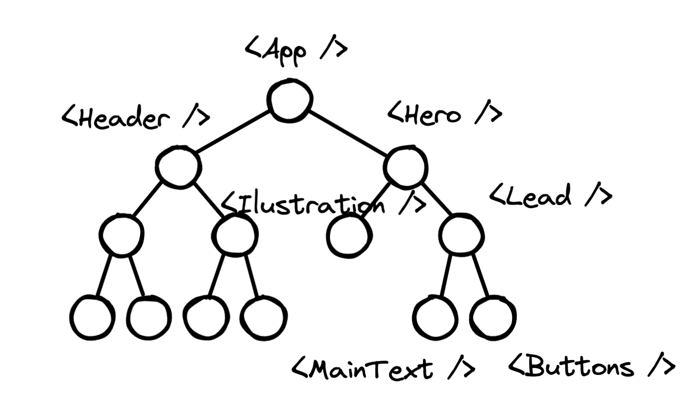

# Componentes

Los componentes son las piezas básicas de las apps de React, como bloques de Lego que podrás usar y reusar para armar UIs complejas. Un componente combina al mismo tiempo apariencia y lógica de programación. Pueden ser tan pequeños como un botón, pasando por secciones y hasta páginas enteras.

Se pueden definir como clases o  funciones, pero los componentes funciones son más modernos y directos. Un componente función recibe *props* (propiedades) y devuelve elementos JSX. Aquí nos concentraremos en su definición, estructura e instanciación, posteriormente veremos sus `props` y su `state`.

## Definición y uso

El nombre de la función se da en PascalCase y devuelve JSX. Normalmente crearemos los componentes en archivos aparte, por lo que se deben exportar:

```jsx
// MiBoton.js
export default function MiBoton() {
  // más lógica de JavaScript
  return <button>Clic</button>;
}
```

Una vez definido, podemos usarlo varias veces (instanciarlo) usando el estilo de JSX con etiquetas: `<NombreComponente />`. Los componentes de JSX están en mayúscula para diferenciarlos de las etiquetas HTML. Y ya que viene de otro archivo debemos importarlos:

```jsx
// MiApp.js
import MiBoton from './MiBoton';

function MiApp() {
  return (
    <div>
      <h1>Mi app en React</h1>
      <MiBoton />  // instancia de componente
    </div>
  );
```

Al igual que la estructura en árbol de HTML, los componentes de react también pueden verse como un árbol de componentes.

## Ejercicio 1

En la carpeta `ej-1-componentes` podrás encontrar el primer ejercicio de componentes. Allí encontrarás dos carpetas: una llamada `vanilla` donde está una parte del sitio web de Khan Academy creada usando solamente HTML y CSS normal; la otra llamada `react` donde se encuentra una app de React. 

El **reto** es rehacer el mismo sitio pero usando componentes de React. Es un ejercicio de maquetado, queda a tu elección cómo agrupar los componentes:


Aquí te mostramos un posible árbol de componentes:



Puedes hacerlo correr dando `npm install` para instalar los módulos necesarios y luego `npm start` para correr el servidor de desarrollo.

## Ejercicio 2

En la misma carpeta puedes encontrar el segundo ejercicio, donde debes maquetar la app de lista de tareas que hicimos al inicio. Una posible opción de árbol de componentes es la siguiente:

