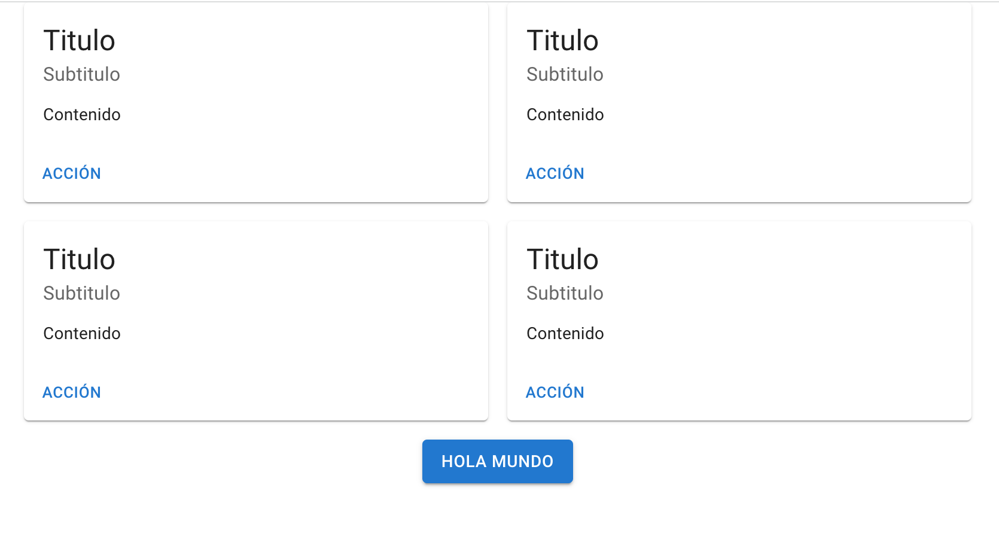

# Estilos

En React existen varias formas de trabajar con estilos. Aquí veremos las más comunes.

## Importando CSS

Esta es la forma más tradicional, simplemente:

- Importa la hoja de estilos con la sintaxis de ES Modules
- En vez de `class` usa `className`
- Trabaja normalmente en el archivo CSS

```jsx
import './mi-estilo.css';

function Tarjeta(props){
  return (
    <div className="card-a">
      
      <h1 className="titulo">{props.nombre}</h1>
      <p>{props.desc}</p>
    </div>
    );

```

## Objeto de estilo (CSS in JS)

Otra opción es definir CSS en un objeto JS, pero su sintaxis debe cumplir con JS:
- Los nombres de las propiedades en vez de en kebab-case deben estar en camelCase
- Los valores si no son numéricos se pasan siempre en string
- Las propiedades se separan con comas:

```jsx
const estilo = {
  borderStyle: 'solid', 
  backgroundColor: 'snow'
}

function Tarjeta(props){
  return (
      <div style={estilo}>
        
        <h1>{props.nombre}</h1>
        <p>{props.desc}</p>
      </div>
    );

```

## Estilo en linea

O directamente poner estilos al atributo `style`:

```jsx
function Tarjeta(props){
	return (
  <div style={{borderStyle: 'solid', backgroundColor: 'Snow'}}>
    
    <h1>{props.nombre}</h1>
    <p>{props.desc</p>
  </div>
  );

```

## Material UI

Existen muchos frameworks de estilo o “sistemas de diseño” para trabajar con React: [Bootstrap](https://react-bootstrap.github.io/), [Semantic UI](https://semantic-ui.com/), [chakra](https://chakra-ui.com/), [Ant](https://ant.design/), entre otros. Lo que tienen en común es que ya tienen componentes pre-diseñados que podemos importar y personalizar fácilmente, ahorrándonos el tiempo de diseñar nuestros propios componentes, aunque igual tendremos luego que pensar en la funcionalidad.

El más popular es [Material UI](https://mui.com/), que veremos brevemente aquí:

Para instalarlo en tu linea de comandos debes poner:

```bash
npm install @mui/material @emotion/react @emotion/styled # para instalar la libreria
npm install @mui/icons-material # para instalar los iconos svg
```

También debes enlazar estas fuentes e iconos en la sección head del `index.html` del proyecto de React para que tener coherencia con el estilo de Material UI:

```bash
<link
  rel="stylesheet"
  href="https://fonts.googleapis.com/css?family=Roboto:300,400,500,700&display=swap"
/>
<link
  rel="stylesheet"
  href="https://fonts.googleapis.com/icon?family=Material+Icons"
/>
```

Ahora sí, estamos listos para usar los componentes de esta libreria. Para ello:

- Busca en la documentación de la libreria qué componentes de interesan: [https://mui.com/material-ui/](https://mui.com/material-ui/)
    - Es bueno empezar con los componentes de layout: [Container](https://mui.com/material-ui/react-container/) y [Grid](https://mui.com/material-ui/react-grid/)
    - Luego con algunos de contenido como: [Card](https://mui.com/material-ui/react-card/)
    - Y el resto dependerá de tus requerimientos particulares
- Importas los componentes elegidos
- Los usas y empiezas a personalizar sus atributos. En la misma documentación te indica que props puedes pasar al componente para que se vea o comporte de cierta forma.

Ejemplo:

```jsx
import './App.css';
import Button from '@mui/material/Button'
import { Container, Grid } from '@mui/material';
import CardSimple from './components/CardSimple';

function App() {
  return (
    <Container maxWidth="lg">
      <Grid container spacing={2} >
        <Grid item xs={6}>
          <CardSimple />
        </Grid>
        <Grid item xs={6}>
          <CardSimple />
        </Grid>
        <Grid item xs={6}>
          <CardSimple />
        </Grid>
        <Grid item xs={6}>
          <CardSimple />
        </Grid>
        <Grid item xs={12} align="center">
          <Button variant="contained">Hola mundo</Button>
        </Grid>

      </Grid>

    </Container>
  );
}

export default App;
```

Que se renderiza así:



### Ejercicio 5

En la carpeta `ej-5-material-ui` puedes encontrar el anterior ejemplo funcionando. 

El **reto** ahora es crear la página principal de un sitio web con todos los componentes de Material UI necesarios.
